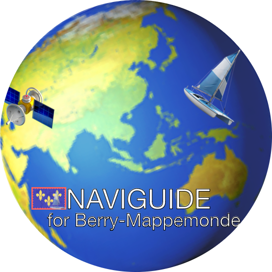
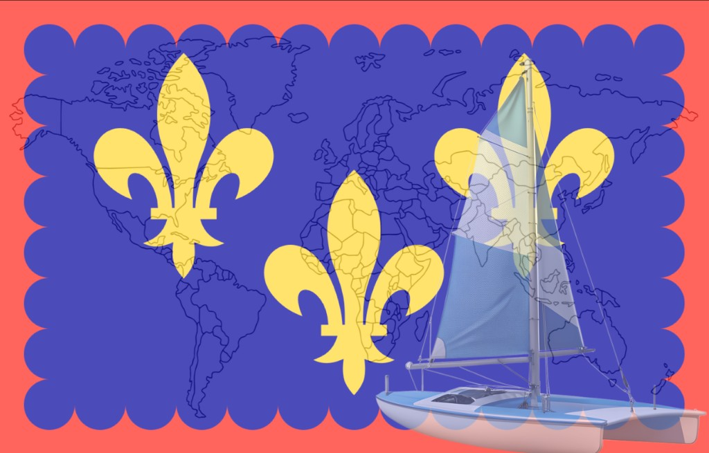

<div align="center">

# Blue Intelligence

**Maritime OSINT Swarm** — Autonomous mapping of marine conservation projects

<br />

<table>
  <tr>
    <td align="center" width="33%">
      <a href="https://github.com/NAVIGUIDE-for-Berry-Mappemonde/Blue-Intelligence" target="_blank" rel="noreferrer">
        
      </a>
      <br />
      <strong>Blue Intelligence</strong>
      <br />
      <sub>Maritime OSINT</sub>
    </td>
    <td align="center" width="33%">
      <a href="https://naviguide.fr" target="_blank" rel="noreferrer">
        
      </a>
      <br />
      <strong>NAVIGUIDE</strong>
      <br />
      <sub>Intelligent navigation</sub>
    </td>
    <td align="center" width="33%">
      <a href="https://berrymappemonde.org" target="_blank" rel="noreferrer">
        
      </a>
      <br />
      <strong>Berry-Mappemonde</strong>
      <br />
      <sub>Maritime expedition</sub>
    </td>
  </tr>
</table>

<br />

*Impact module of the NAVIGUIDE ecosystem — 45,000 nautical miles, 13 overseas territories*

</div>

---

## About

**Blue Intelligence** transforms the living web of maritime data into an executable geospatial database. The application deploys AI agents (TinyFish + Claude) to discover, extract, and map marine conservation projects worldwide.

- 🗺️ **Interactive map** — GeoJSON projects, clusters, filters by funder
- 🤖 **ETL Swarm** — Autonomous discovery via MasterSeeds + DeepLinkCache
- 🌊 **3-stage pipeline** — Haiku gatekeeper → Sonnet extract → S_ocean scoring
- 📍 **Coastal snapping** — Coordinates recalculated to maritime zones
- 🔄 **100% local** — SQLite, runs entirely on your machine

---

## Quick start

**Prerequisites:** Node.js 18+

```bash
# 1. Install dependencies
npm install

# 2. Configure API keys (copy .env.example to .env)
# - TINYFISH_API_KEY (required for extraction)
# - CLAUDE_API_KEY or ANTHROPIC_API_KEY (required for analysis)

# 3. Run the application (GSHHG crude is embedded, no download needed)
npm run dev
```

Open [http://localhost:3000](http://localhost:3000).

---

## Links

| | |
|---|---|
| **NAVIGUIDE** | [naviguide.fr](https://naviguide.fr) |
| **Berry-Mappemonde** | [berrymappemonde.org](https://berrymappemonde.org) |
| **GitHub** | [NAVIGUIDE-for-Berry-Mappemonde/Blue-Intelligence](https://github.com/NAVIGUIDE-for-Berry-Mappemonde/Blue-Intelligence) |

---

<div align="center">

*Blue Intelligence — Maritime OSINT Swarm for NAVIGUIDE and Berry-Mappemonde*

</div>
